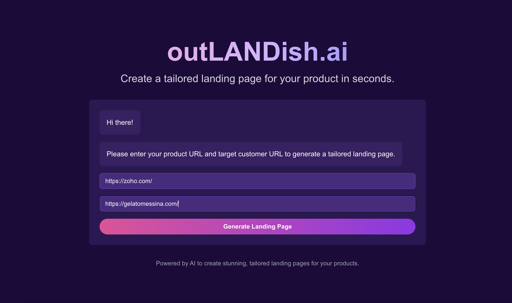
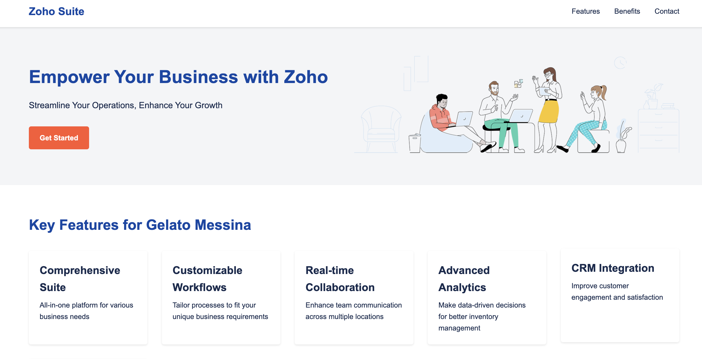
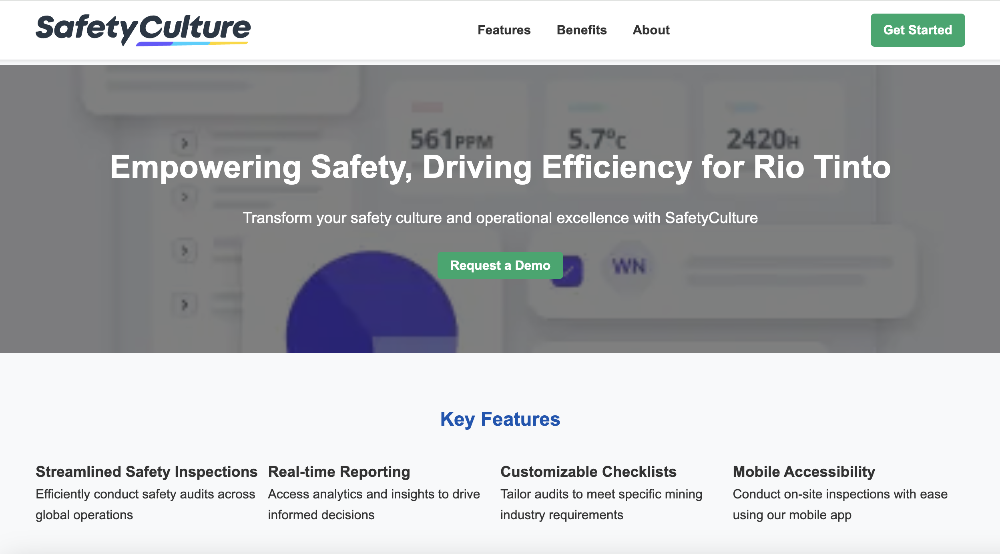

# outLANDish.ai
Create a tailored landing page for your product in seconds.

Whether it's selling a CRM product to a gelato chain, or selling a safety management platform to a mining giant, **outLANDish.ai** is your one-click AI tool to generate landing pages tailored to the target company's profile!

Our submission for the SXSW Sydney Build Club AI Hackathon 2024.

Team: Chris Yoo, Shreya Mukherjee, Shuwei Guo

*Landing page of Zoho for Messina*

*Landing page of SafetyCulture for Rio Tinto*

## How it works
1. The user provides the URL to the product and the URL to the target company.
2. The backend will perform a preliminary web scraping of the product company's website to gather static image assets that may be used later in the landing page.
3. The product URL, target company URL and scraped image URLs are all sent into an AI agent built with [Relevance AI](https://relevanceai.com/). We call this the **Mother Agent**.
4. The **Mother Agent** first dispatches the **Researcher Sub-Agent**, which will use Google search, website scraping and LinkedIn search to gather information about both the product and the target company, and figure out the strong selling points that the product has towards the specific company.
5. Taking the output from the first sub-agent, the **Mother Agent** dispatches the **Website Generator Sub-Agent** which scrapes the product website to gather design inspirations, then uses Claude 3.5 to generate a HTML and CSS file for a single static web page to market the product.
6. Taking the HTML and CSS output, the **Mother Agent** dispatches a final **QA Sub-Agent**, which ensures that the produced code is valid and conforms to design standards, and applies fixes if necessary to correct style infringements.
7. This final HTML and CSS is returned to the backend, which hosts them for the front-end to redirect to. Magic!

## Quick start
1. Inside /frontend, run the frontend with `npm run dev` (port 3000)
2. Inside /backend, run the backend with `flask run` (port 5000)
3. Inside /backend, run the HTTP server with `python3 -m http.server` (port 8000)